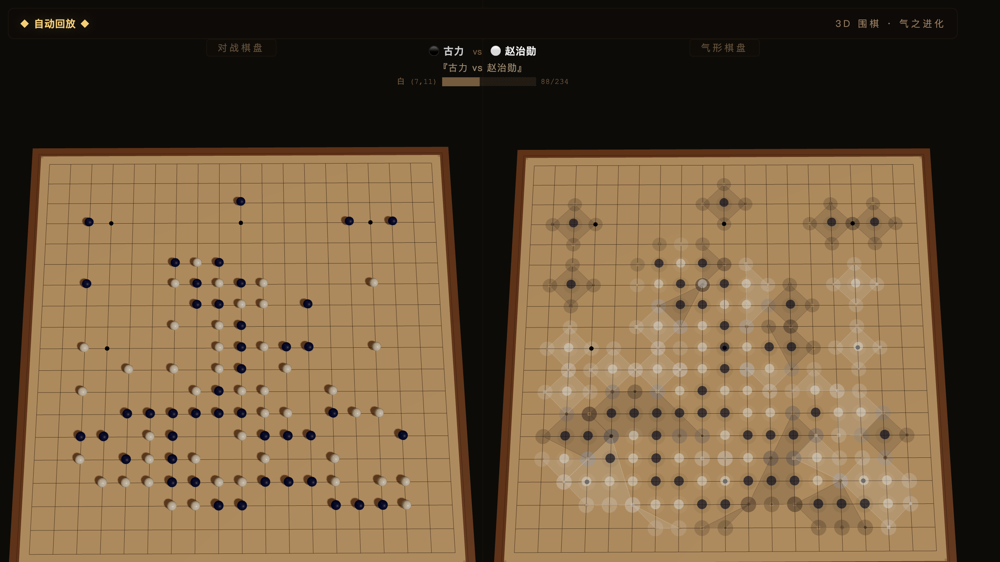
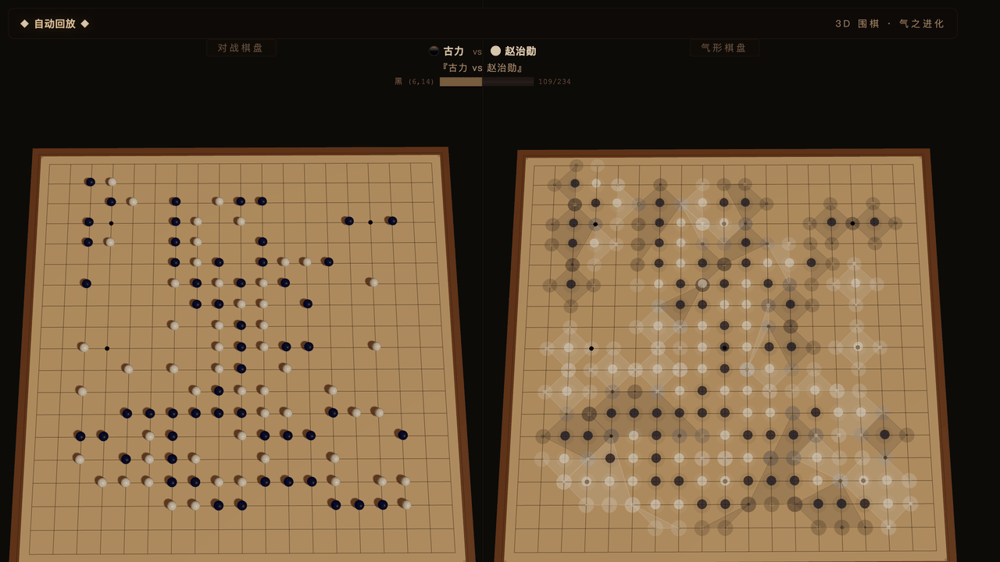

# 3D 围棋 · 气之进化

<div align="center">





**3D 可视化围棋 AI 对弈平台 | 形状识别 × AI 成语解说 × 自动进化迭代**

[](https://www.python.org/)
[](https://fastapi.tiangolo.com/)
[](https://threejs.org/)
[](LICENSE)

</div>

---

## ✨ 特性

- 🎮 **3D 可视化棋盘** — 基于 Three.js 的精美 3D 围棋界面，支持旋转、缩放、多视角切换
- 🤖 **AI 自对弈** — 黑方「黑龙」vs 白方「白凤」，多种棋风（均衡流、力战派、实地派、宇宙流、古风稳重）
- 📜 **棋谱研究** — 内置多盘历史名局（耳赤之局、神之一手等），支持加载外部 SGF 棋谱
- 💬 **AI 成语解说** — 实时分析棋局，用中文成语意境点评每一步棋
- 🧬 **进化引擎** — 自动迭代优化 AI 棋力，代际进化可视化
- 🌐 **Web 服务** — FastAPI + WebSocket 实时对弈，浏览器即开即用
- 🎯 **形状识别** — 自动识别围棋经典形状（跳、飞、尖、拆、虎、双、长等）

## 🚀 快速开始

### 环境要求

- Python 3.9+
- 现代浏览器（Chrome / Firefox / Edge）

### 安装运行

```bash
# 克隆仓库
git clone https://github.com/phoenixyun/qi-evolution.git
cd qi-evolution

# 安装依赖
pip install -r requirements.txt httpx

# 启动 Web 服务
python3 server.py

# 浏览器打开
open http://localhost:8765
```

### 桌面版（本地 3D 渲染）

```bash
python3 launcher.py
```

## 🎮 操作说明

| 快捷键 | 功能 |
|--------|------|
| `Space` | 暂停 / 继续 |
| `+` / `-` | 加速 / 减速 |
| `R` | 重置对局 |
| `←` / `→` | 上一步 / 下一步 |
| `A` | 自动打谱 |
| `⏹` | 停止打谱 |

## 🤖 LLM AI 配置（可选）

系统默认使用本地 AI 对弈。如需接入大语言模型提升棋力和解说的智能程度，可配置环境变量：

```bash
cp .env.example .env
# 编辑 .env，填入你的 API Key
```

> ⚠️ `.env` 已在 `.gitignore` 中，不会被提交到 Git。支持兼容 OpenAI API 格式的服务（DeepSeek、OpenAI 等）。

## 📁 项目结构

```
├── server.py          # FastAPI Web 服务入口
├── main.py            # 桌面 3D 客户端（Ursina）
├── launcher.py        # 桌面版启动器
├── go_engine.py       # 围棋规则引擎（气、提子、劫）
├── ai_player.py       # 本地 AI 棋手
├── llm_player.py      # LLM 驱动的 AI 棋手
├── commentator.py     # 成语意境解说
├── visualizer.py      # 3D 可视化渲染
├── sgf_parser.py      # SGF 棋谱解析器
├── frontend/          # Web 前端（HTML/CSS/JS + Three.js）
├── sgf/               # 示例 SGF 棋谱
├── evolution/         # 自动进化引擎
└── .env.example       # 环境变量模板
```

## 🛠 技术栈

- **后端**: Python / FastAPI / WebSocket
- **前端**: Three.js / Canvas / 原生 JavaScript
- **AI**: 蒙特卡洛搜索 + 启发式评估 + LLM 增强（可选）
- **3D 桌面版**: Ursina Engine

## 📄 License

MIT License

---

<div align="center">
⚫ 「黑龙吐珠吞日月」 ⚪ 「白凤展翅定乾坤」
</div>
